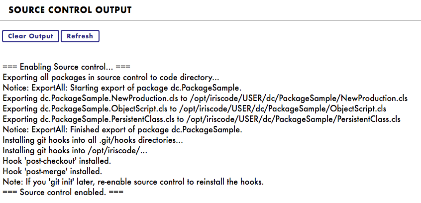

# Git for IRIS

[](https://openexchange.intersystems.com/package/git-for-iris)
[](https://github.com/MW-de/git-for-iris)
[](https://www.intersystems.com/products/intersystems-iris/)
[](https://opensource.org/licenses/MIT)

**Git for IRIS** is a Source Control package that aims to facilitate a  **native integration of the Git workflow** with the InterSystems IRIS platform.

Similar to Caché Tortoize Git and Port, it keeps a *code directory* in sync with the internal packages that can be put under source control with Git. However, it is designed to work as a transparent link between IRIS and Git that, once setup, requires no user interaction.

## How it works

### Basic principles 

- **Server-based:** Git for IRIS runs on the IRIS server (not in Studio).
- **Tasks performed in IRIS:** Create and edit classes. Nothing else, source control-wise.
- **Tasks performed in Git:** `git *`: commit, push/pull, branch switching, merge.

## Installation

- Clone repo, build and run the docker image from a terminal window:
```
git clone https://github.com/MW-de/git-for-iris.git
cd git-for-iris
docker build -t git-for-iris:0.1 --cpuset-cpus="0-3" .
docker-compose up -d
```

- Go to the **Management Portal** in http://localhost:9092/csp/sys/UtilHome.csp (Login with `_system:SYS`) and [activate the source control class](https://docs.intersystems.com/irislatest/csp/docbook/Doc.View.cls?KEY=ASC#ASC_Hooks_activating_sc_class):

- Go to **System Administration > Configuration > Additional Settings > Source Control**

- For namespace **USER**, choose **SourceControl.Git.Git** and save.

- Access the source control menu, e. g. in a [production](http://localhost:9092/csp/user/EnsPortal.ProductionConfig.zen?PRODUCTION=dc.PackageSample.NewProduction), and click **Enable Source Control**.


The source control output window can be opened by clicking on the second item: 



## Usage

Git for IRIS is used with a Git client. You may use the command line Git client or an IDE like VSCode (optionally with Remote SSH). In this docker example, the `git` client will be used within the docker image. In the terminal window, run:

```
docker-compose exec -u 52773 iris-git /bin/bash
cd /opt/iriscode
```

### Usage example

You may now edit some code in IRIS. As an example, go to **[Interoperability > Business Process Designer](http://localhost:9092/csp/user/EnsPortal.BPLEditor.zen?$NAMESPACE=USER&$NAMESPACE=USER&)** and create a new BPL process. Save it in package `dc.PackageSample` as `SampleBPLProcess`. Since the `dc.PackageSample` package is under source control, it will be exported to `/opt/iriscode`. In the docker terminal, run:

```
git add .
git commit -m "add new BPL process"
```
Now let's create a branch:

```
git checkout -b testing-branch
```
Back in the BPL editor, **make some changes** in `dc.PackageSample.SampleBPLProcess`, like adding a BPL element to it, and save the BPL process.

```
git commit -a -m "change BPL process"
```

Now let's switch back to the master branch:

```
git checkout master
```

... and refresh the browser window. The BPL will be reverted to the state in `master`. Switching branches again ...

```
git checkout testing-branch
```
... will get the newer version back.

This workflow extends to all other actions in Git, including working with remote repos and pull/merge.

## Detailed description

### Workflow

- **Automatic Export:** IRIS exports all changes to the code directory upon save and compile.
- **Automatic Import:** Git informs IRIS about updates (pull/merge, checkout) via Git hooks, which triggers import of changed classes through a REST endpoint in IRIS.
- **Conflicts:** All conflicts are managed through Git.
- **Explicit import/export**: Although there are menu items to import and export the classes, **no user interaction is required** in regular workflows.
- **Git control:** IRIS does not execute any Git commands. Instead, Git is used natively through the command line or an IDE (e.g. VSCode with Remote SSH). As a developer, you operate on the code directory as you would on any other development workspace.

### Details

- **Configuration:** Source control can be configured namespace-wise. Mapping of the Global `Git.*` among multiple namespaces makes them share the same source control configuration.
- Git for IRIS is **package-based**. No projects are supported.
- For each package and its subpackages, there is an "owner" namespace where exporting and importing happens.
- **Class export format** is UDL.

### Configuration API

Add/remove package to/from source control:
```
do ##class(SourceControl.Git.Utils).AddPackageToSourceControl(<package name>, <namespace>)
do ##class(SourceControl.Git.Utils).RemovePackageFromSourceControl(<package name>)
```

Globally (that is, among all namespaces that share the same `^Git.Config` mapping) enable/disable source control synchronization (same as in the Source Control Menu):
```
do ##class(SourceControl.Git.Utils).SetSourceControlStatus($$$YES / $$$NO)
```
Enabling source control will install the git hooks and export all classes currently under source control to the code directory. If the code directory has gone out-of-sync in the meantime, IRIS still exports the current internal state of all classes, and potential conflicts shall, by design, be managed through Git (`git merge`).


## TODOs and limitations

**Git for IRIS** is currently in beta. The core features are implemented and ready to use. Known limitations are:

- Currently, only classes are supported.
- UI controls are rudimentary or not implemented yet (add/remove packages from source control, settings).
- Log output is rather verbose at the moment.
- Files and classes will not be deleted at the moment.
- The REST endpoint for the Git hooks (`/csp/user/sc`) is currently not secured.
- No git hook is available for `git stash`, so IRIS will not be notified about stashing.

## Acknowledgement

This project is based on [Caché Tortoize Git](https://openexchange.intersystems.com/package/Cach%C3%A9-Tortoize-Git) by Alexander Koblov. This project started as a fork of the original project, however, most of the code has been rewritten.